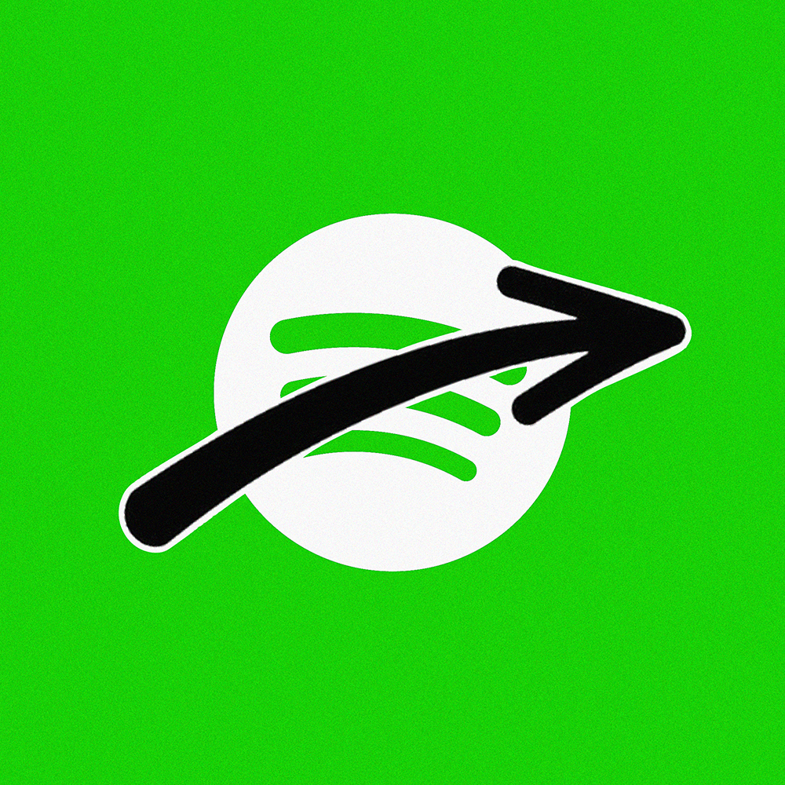

<h1 align="center">Youtube Keybinds for Spicetify</h1>

<p align="center">
  
</p>

<p align="center"><b>YouTube Keybinds</b> is a lightweight Spicetify plugin that brings YouTube-style keyboard shortcuts to your Spotify experience. Control playback, navigate tracks, and adjust volume seamlessly using simple, intuitive keybindings.</p>

## Key Features
- Jump to specific sections of a track using number keys (`0-9`).
- Use the arrow keys for precise control:
  - **Left Arrow**: Skip backwards by 5 seconds.
  - **Right Arrow**: Skip forwards by 5 seconds.
  - **Up Arrow**: Increase volume by 5%.
  - **Down Arrow**: Decrease volume by 5%.
- Additional playback controls:
  - **J**: Skip backwards by 10 seconds.
  - **L**: Skip forwards by 10 seconds.
  - **K**: Toggle pause/play.
  - **M**: Mute/unmute.
  - **Shift + N**: Skip to the next track.
  - **Shift + P**: Skip to the previous track.

## Installation

### For Spicetify Marketplace

1. Open Spicetify Marketplace in your Spotify client.
2. Search for **Youtube Keybinds** in the extensions section.
3. Install the extension, and it will be ready to use without any further commands.

### Manual Installation

1. Download the `youtubekeybinds.js` file from the [GitHub repository](https://github.com/rastr1sr/YoutubeKeybindsSpicetify).
   
2. Follow the manual installation steps outlined in the Spicetify documentation:  
   [Spicetify Extensions Documentation](https://spicetify.app/docs/advanced-usage/extensions)

3. After following the steps, apply the changes by running:

    ```bash
    spicetify apply
    ```

## Author

Developed by [Rastrisr](https://github.com/rastr1sr).

Reach out to me on Discord if there are any issues, or if you want to make a pull request

[](https://discord.com/users/558244475521073152)

## Contributing

Feel free to open issues or submit pull requests if you'd like to contribute or suggest improvements!

## License

This project is licensed under the MIT License. See the [LICENSE](./LICENSE) file for details.
